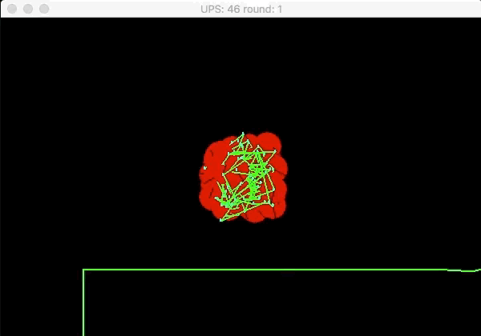
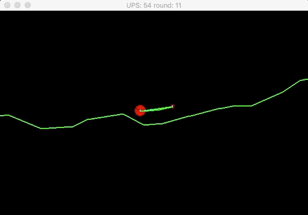
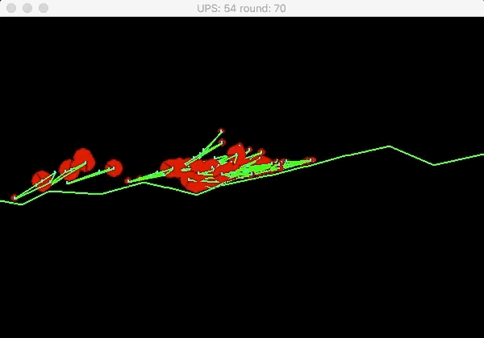

# Car-evolution

A car evolution simulation made with Python, Pygame and Box2D.

## How to run:

 - Create virtualenv with python 3
 - Install dependencies `pip install -r requirements.txt`
 - Run the app `python main.py`

## What is it:

Start with bunch of random cars

The best performing cars survive and mutate while the worst performing variants die off

You can either look at the best performing car

Or see the whole genome

